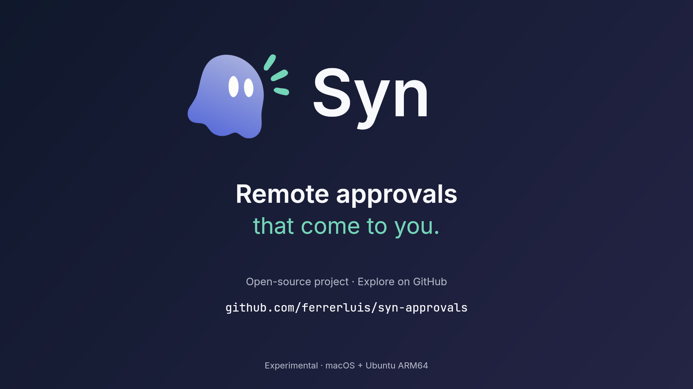

# Syn

**Approve each remote `sudo` request from your Mac.**

If an agent working on your Ubuntu machine needs `sudo` to install a package, Syn pauses that request and shows it on your Mac. You can review the machine, account, executable, and arguments, then choose **Approve once** with Touch ID or your Mac login password, or choose **Deny**. Syn also works for commands you start yourself: it gates eligible invocations by one configured account after normal sudo policy, without trying to tell a human from an agent.

## Watch Syn in action

[](https://d2ol7oe51mr4n9.cloudfront.net/user_3JzA4hCTdreir475NjS89N8dryd/a8958bd6-a883-4e99-9411-9f4612d3af2e.mp4)

[Play the 20-second video](https://d2ol7oe51mr4n9.cloudfront.net/user_3JzA4hCTdreir475NjS89N8dryd/a8958bd6-a883-4e99-9411-9f4612d3af2e.mp4) · [Download the 1080p MP4](assets/media/syn-commercial.mp4)

The video uses fictional machine and command details to illustrate an approval.

## Before you start

- **Mac:** macOS 15 or newer on a Secure Enclave-capable Apple silicon Mac.
- **Remote machine:** Ubuntu 26.04 ARM64 with classic `sudo.ws` 1.9.x. A Raspberry Pi 5 is the tested example, not a requirement.
- **Access:** The remote machine must accept SSH for your chosen account, and that account must be allowed to use `sudo`. The Mac must also reach the remote machine directly on TCP port 41781 for approvals; an SSH proxy alone is insufficient. SSH must permit forced root public-key commands for Syn's restricted maintenance key.
- **Recovery:** Have a trusted remote administrator terminal outside your agents' control and verify independent root-console or Ubuntu recovery access that works without Syn or the Mac. Keep recovery access available until ordinary password sudo or the completed Syn installation and its recovery path have been verified.

## Try Syn

1. [Download the latest experimental Mac ZIP](https://github.com/ferrerluis/syn-approvals/releases/latest/download/Syn-macOS-latest-experimental.zip), open it, and move **Syn.app** into **Applications**. The current ad-hoc-signed build may require macOS's per-app **Open Anyway** confirmation in **System Settings → Privacy & Security**; do not disable Gatekeeper or other system-wide protections.
2. Open Syn and choose whether it starts at login. Select **Add a machine**, enter the reachable hostname, SSH account, and optional SSH port, then click **Check connection**. If Syn shows SSH host fingerprints, compare them with a trusted source before clicking **Trust this host**.
3. Click **Install or update Syn**. On first setup, Syn displays one command. Run it in the trusted administrator terminal on the remote machine, then click **I've run the command — continue** on the Mac. Enter any administrator password only in that remote terminal; Syn does not collect or send it.
4. Follow the Mac's two distinct setup approval requests: one before sudo changes, and a fresh one to verify the installed release. Choose **Approve once** for each only after reviewing it. Wait for setup to report installed and the machine to show **Connected**.
5. From a normal terminal on the remote host, as the configured account, run `/usr/bin/sudo -n /usr/bin/true`. It makes no administrative change. Review the request on your Mac and choose **Approve once**; the command should exit successfully. A nested agent sandbox may block sudo before Syn runs, so use a host terminal for this check.

The Mac ZIP already contains the matching remote source and helper; there is no separate Ubuntu installer to download. If setup fails, keep recovery access and see [recovery](docs/recovery.md).

## What an approval looks like

Syn shows the remote machine, source account, executable, arguments, and time remaining. Arguments that may contain a secret are hidden until you choose **Reveal**. Each approval needs fresh Touch ID or Mac login-password authentication and applies to one invocation.

| Your choice or situation | What happens on the remote machine |
| --- | --- |
| **Approve once** | The signed approval lets that invocation proceed once. |
| **Deny** | A signed denial received by the remote machine stops the invocation without password fallback. If the Mac cannot confirm delivery, check the original remote terminal; it may still offer password fallback after timeout. |
| Press Enter while an interactive request is pending | Syn cancels the request and opens the machine's normal password prompt immediately. |
| No Mac decision within 90 seconds | An interactive terminal may offer the normal password prompt. Unanswered non-interactive `sudo` fails without a prompt; it can still succeed if approved on the Mac. |

The remote sudo plug-in signs the executable, separate arguments, working directory, identities, and environment digest for the invocation already accepted by sudo policy. Invalid data, replay, and local policy rejection fail closed. During everyday sudo use, the remote account password stays in the remote PAM conversation: Syn does not send it to the Mac, save it, or place it in command arguments.

## How setup and connections work

Syn's setup flow is:

1. After you verify any new SSH host fingerprints, the Mac inspects the remote platform and installed state with fixed, read-only operations.
2. It verifies that the Mac app, ARM64 helper, and source archive carry the same compact UTC release ID and exact Git commit.
3. On first setup, it transfers the helper and shows the one-time command. Run it in a trusted remote administrator session, then click **I've run the command — continue**. The command verifies the helper's root-owned copy before authorizing the restricted maintenance key; future updates reuse that access.
4. The remote builds as a locked non-administrator account, installs the exact package, preserves or creates identities, and returns a certificate-pinned profile over SSH.
5. A signed preflight approval succeeds before Syn changes sudo. A local reboot-persistent recovery deadline remains armed until a second, fresh approval verifies the exact live release and sudo configuration.

Only the remote machine's public profile returns to the Mac. The target authorization private key stays remote; Mac authorization keys and the client identity stay in Keychain or the Secure Enclave.

The separate maintenance SSH key stays in a private directory under the Mac's `~/Library/Application Support/Syn/Maintenance`. The remote entry forces Syn's fixed dispatcher and disables forwarding, user startup hooks and terminal allocation. SSH must permit forced root public-key commands; Syn will not enable unrestricted root login or change your SSH policy. This key authorizes privileged Syn installation, so protect it like an administrator credential.

Setup uses SSH to inspect, transfer, build, install, pair, update, recover, or uninstall Syn. Everyday approvals use a direct mutually authenticated TLS connection, with no SSH tunnel, VPN-provider integration, or Syn cloud relay. The remote agent listens on the server-side address selected during SSH setup, on TCP port 41781, while the Mac reconnects through the hostname you supplied. Reachability can come from a LAN, an existing private network, or another route you control; Syn neither configures a network provider nor opens public ingress.

Approval messages bind both endpoints to the exact compiled release ID and commit. A valid signature from another release is still rejected, and the Mac reports a mismatch as update required rather than attempting approval.

## Update, recovery, and uninstall

**Update** is Mac-led and uses SSH again. It preserves the target identity and settings, restores ordinary password sudo before package replacement, installs the Mac's exact remote release, and keeps the previous recovery helper until the updated release passes its fresh final approval.

If setup disconnects or stops after privileged state may exist, retry resumes from the protected operation journal or runs local recovery; it never treats a lost SSH reply as success. Recovery removes Syn's `NOPASSWD` rule first, restores ordinary password sudo and provider state, and retains protected keys and backups.

To stop using Syn, run `sudo /usr/bin/synctl uninstall --restore-local-sudo --apply` in a trusted terminal on the remote machine, then verify ordinary password sudo works. Uninstall follows the same safety ordering, revokes Syn's restricted maintenance SSH entry, disables its runtime service, and removes the package. Pairing keys, the recovery helper, and sudo backups remain available for conservative recovery rather than being silently deleted. The Mac app's **Remove** button only forgets the saved machine and stops its connection; it does not change remote sudo or pairing, so use it after remote uninstall.

To revoke only the Mac's maintenance access while keeping Syn installed, run `sudo /var/lib/syn/maintenance/synctl --json maintenance revoke --apply` in a trusted administrator session on the remote machine. Revocation removes only Syn's recorded SSH entry; unrelated keys and recovery access remain. A replacement Mac needs a new bootstrap after revocation.

## Current support and distribution limits

- Topology: one managed remote account and one approving Mac per remote target; one Mac may store several targets.
- Distribution: source and experimental release assets are publicly accessible. Syn has not received an independent security review; treat these builds as experimental.
- Signing: current development builds use ad-hoc signing and are not Developer ID signed or notarized. They may produce normal macOS provenance/security prompts; do not disable system-wide protections to bypass them.

See the [hybrid acceptance results](docs/validation/2026-09-14-onboarding-e2e-results.md), [September 9 implementation checkpoint](docs/implementation-status.md), [protocol](docs/protocol.md), [threat model](docs/threat-model.md), [recovery](docs/recovery.md), and the [SSH maintenance contract](docs/ssh-maintenance-contract.md) before live use.

## Repository layout

- `crates/syn-protocol`: signed wire types, deterministic encoding, and validation.
- `crates/syn-agent`: rootless Unix-socket to direct mTLS WebSocket relay.
- `crates/syn-sudo-plugin`: classic sudo approval ABI and PAM fallback.
- `crates/synctl`: diagnostics and guarded lifecycle operations.
- `macos`: native SwiftUI approver and Mac-led setup source.
- `packaging`: remote service, PAM, policy, and Debian package assets.
- `docs`: security, protocol, recovery, implementation, and validation records.

## Developer checks

Rust 1.85+, Swift 6/Xcode, clang, and pkg-config are required.

```sh
make check
make test
make lint
make macos-app
```

Human-readable CLI output is the default. `--json` emits one stable JSON value; diagnostics go to stderr, and security-sensitive changes require root plus explicit `--apply`. There is no network command-submission API.

## License

Licensed under either Apache-2.0 or MIT, at your option.
