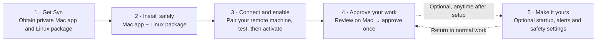
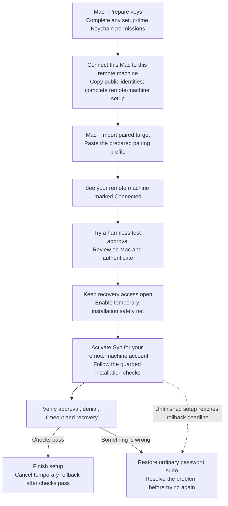
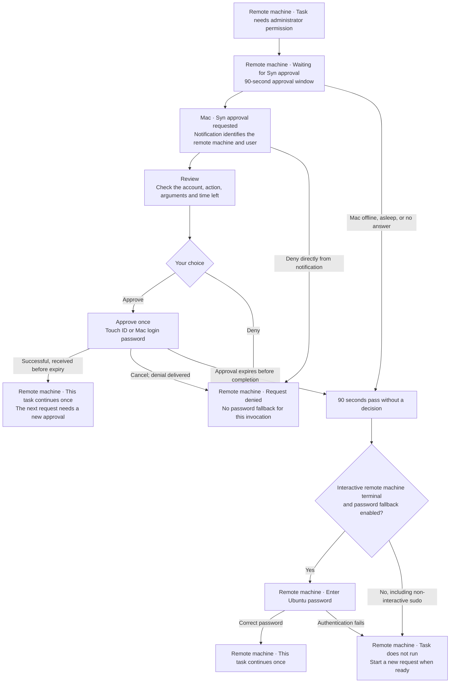

# Syn: the user experience

**Let agents work on your remote machine. Approve their administrator actions from your Mac.**

This is a feature-first map of the current private alpha, based on the source at `629c865`, with proposed UX changes explicitly marked. It describes what you do and see—not Syn's internal architecture. Setup is still manual; this is not a claim that a public download or guided installer exists. Planned work is tracked in [TODOS.md](../TODOS.md).

**Updated product direction (not implemented):** the [revised delivery plan](distribution-onboarding-plan.md) supersedes older proposals here. Setup and updates will happen from the Mac over SSH, with matching timestamp releases and provider-independent hostname connections. Interactive Enter-to-password and the first-launch startup choice are included. The manual setup and overlay requirements below describe the current alpha, not the intended finished flow.

## The whole journey

**Where Syn fits:** Syn gates `sudo` on the remote machine. There is no direct integration with Windows App, remote desktop, SSH, or a particular agent; those are simply ways of working on that machine. No SSH-forwarding session is needed for Mac approvals.

| Who is doing the work? | Desired experience | Current alpha |
| --- | --- | --- |
| You, in an SSH or remote-desktop terminal | Ask for the remote account's password there immediately. | The configured managed account still starts with Syn, then offers eligible password fallback after 90 seconds. |
| An agent using the remote machine | Ask you on the Mac before each administrator action. | Syn requests a Mac decision for each eligible invocation by the managed account. |

**Planned password escape, not implemented:** Syn will not distinguish humans from agents. While an interactive request is pending, pressing Enter cancels that request and starts remote-password verification immediately. Enter is never approval or proof of human presence, and cannot override a completed hard denial. See TODO 3, now included in the delivery plan.

## Get Syn and install it

| Feature | What you do | What you get |
| --- | --- | --- |
| Get the two apps | Obtain or build the private Mac app and Ubuntu ARM64 package from the repository. | One app for approving on the Mac; one package for the remote machine that needs approval. No public download page or App Store release yet. |
| Install on the Mac | Place Syn in Applications and open it. Allow notifications when macOS asks. | A menu-bar app, a main window, and approval alerts. |
| Install on the remote machine | Install the package with existing administrator access. | Syn is available, but your normal sudo/password behavior stays unchanged until you explicitly activate it. |
| Make the devices reachable | Connect both devices through the same supported private overlay network: Tailscale or Nord Meshnet, with access rules permitting communication. | The Mac can receive requests while you are away from home, without a Syn cloud account or an SSH tunnel. This does not require the same physical LAN or VLAN. |

**Supported starting point:** Ubuntu 26.04 ARM64 on the remote machine (validated on a Raspberry Pi 5); macOS 15 or newer on a Secure Enclave-capable Mac. Keep another working way to recover administrator access to the remote machine before activating Syn; spare hardware is not required.

## Connect your remote machine and turn approvals on

- **Pairing today:** the Mac has **Prepare keys**, **Copy public identities**, and **Import paired target** controls. The remote-machine work and profile transfer still require the setup runbook; there is no QR scan or automatic discovery wizard yet.
- **Two different kinds of permission:** setup-time Keychain access lets Syn use its own saved identities. It does not approve future commands; each command still gets a fresh Touch ID or Mac login-password check.
- **Know when you are ready:** your remote machine appears as **Connected**, a harmless approval test succeeds, and the guarded activation checks pass. “Connected” alone does not mean Syn has taken over sudo approvals.

One Mac can approve for several remote machines. Each remote machine currently uses one approver Mac and one managed Linux account; other accounts are not automatically enrolled.

### Why installation has a rollback deadline

Syn changes how administrator access works. If setup fails, a connection breaks, or the new approval path stops working, an automatic rollback restores ordinary password sudo so you do not remain locked out of administrator access. It is a temporary installation/reconfiguration safeguard—not the 90-second command timer or a timer needed for normal daily use.

The current alpha exposes arming and canceling this safeguard as manual setup steps. A polished installer should manage it, show a plain-language recovery countdown, and only finish after a real approval and health check succeed; the user should not need to manage timers. Independent recovery access still matters if the installer itself fails. See TODO 1.

## Approve an administrator action

Example: Codex needs to install GitHub CLI on the remote machine. It requests the installation normally, and the original task waits for your decision.

### What you can inspect before approving

| Feature | What you see or do |
| --- | --- |
| Private notification preview | The alert shows the target and requesting user, not command contents. **Review** opens the request; approval is not available directly from the notification. |
| Action review | See which remote machine, who requested it, which account it will run as, the working folder, the executable, and each argument separately. Environment variable names are visible, not their values. |
| Extra scrutiny | Inspect the target fingerprint, warnings and countdown. Possible secret-bearing arguments are initially masked; **Reveal** lets you inspect them. |
| One-use approval | **Approve once** requests fresh system authentication. The Mac login password is an intentional alternative to Touch ID—not the Ubuntu password. |
| Quick rejection | **Deny** needs no fingerprint. Once the remote machine receives the denial, that invocation cannot switch to password fallback. |
| Several requests | Today, review each pending request separately. Time-limited **Always approve** is proposed in TODO 2, not available in this build. |

### When something interrupts the flow

- **Mac asleep, Syn quit, or network unavailable:** no automatic approval. The remote machine waits until the deadline, then offers the Ubuntu-password fallback only if enabled and an interactive terminal is available. A headless Codex task may have nowhere to enter that password and will fail instead.
- **Prefer to type the password now?** TODO 3 proposes pressing Enter once during an interactive Syn wait to cancel that pending approval and start the remote account's password prompt immediately. This shortcut does not exist yet and must not turn a denial or invalid request into a bypass.
- **You cancel the remote machine task:** its request is no longer usable; a late approval cannot revive it. If you miss the countdown, start a new invocation rather than approving an expired request.
- **Delivery is uncertain:** the Mac may warn that an approval could not be confirmed. Check the original remote machine task before retrying; a connection error is not proof that the task did not execute. An undelivered denial may still lead to timeout fallback.
- **Syn blocks the request as unsafe or invalid:** the task stops without a password fallback. A local safety rule can block it before any Mac notification appears.

## Optional configuration

These are separate from the initial approval journey. The alpha does not yet have one unified Settings screen for everything.

| Feature | Where you change it | What changes for you |
| --- | --- | --- |
| Start automatically | Mac app → **Launch Syn at login** | Syn starts when you log in. TODO 4 adds a first-launch Yes/No prompt with Yes recommended; the prompt is not implemented yet. This does not wake a sleeping Mac or approve anything automatically. |
| Notification behavior | macOS System Settings → Notifications → Syn | Control alert presentation and sound. Turning alerts off does not approve requests or stop the countdown; you can still review pending requests in Syn. |
| More remote machines | Mac app → **Import paired target**, after each remote machine's setup | Approve multiple targets from the same Mac. |
| Retry a connection | Mac app → **Retry connection** | Reconnect a disconnected target after resolving the reported problem. |
| Remove a target from this Mac | Mac app → **Remove** | Forget its local profile and connection. This does not restore normal sudo on the remote machine or revoke the remote machine's saved pairing by itself. |
| Ubuntu-password fallback | Administrator-controlled policy on the remote machine | Enabled by default after 90 seconds of ordinary unavailability. Disable it if unanswered requests should always fail; denials and invalid requests never qualify. |
| Root-shell restrictions | Administrator-controlled policy on the remote machine | Obvious shells/interpreters are restricted by default; an administrator can relax the policy. This is accident prevention, not a guarantee that an approved installer cannot make powerful changes. |
| Private-network choice | remote machine connection configuration and paired Mac profile | Select the supported Tailscale or Nord Meshnet path during setup or a deliberate reconfiguration—not an automatic failover toggle. |
| Stop using Syn | remote-machine recovery / unpair / uninstall tools | Restore ordinary password sudo safely. Unpairing also removes the remote machine's current approver pairing; full file/key cleanup is separate. |

**Fixed in this alpha:** 90 seconds, fresh authentication for every approval, one-use decisions, and no standing grants. TODO 2 proposes **Always approve** for 5, 15, or 30 minutes, or 1 hour, with Mac activity history and a visible stop control. That deliberately replaces per-command human review for the chosen period; an activity log cannot undo an unsafe administrator action. No phone-push or 1Password credential-approval feature exists.

## Reading this as a product map

The product focus is **human approval of agent-initiated administrator work on remote machines**, while keeping password-based manual work convenient. The main unfinished onboarding work is **public distribution and guided pairing/setup**; do not mistake the manual steps above for a polished installer flow. [TODOS.md](../TODOS.md) separates that work from the current alpha's behavior.

This map describes the checked-out implementation, not a fresh validation of any installed device. For execution details and security limits, use the [setup runbook](alpha-runbook.md), [live validation plan](live-pi-validation-plan.md), [implementation status](implementation-status.md), and [branch hardening notes](p1-hardening.md). UI labels come from [the Mac views](../macos/Sources/Syn/Views.swift); optional remote machine controls come from [the CLI](../crates/synctl/src/main.rs).
